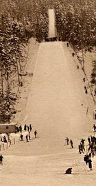

# I Believe I can fly

## Context

### Objective:

```
1/ Find the municipalities of the springboard (ex: Puy Saint Vincent --> puy_saint_vincent)
2/ Name of last record holder in the springboard (ex: Jean Dupont --> jean_dupont)
3/ The date of the first record of the springboard (ex: 18/01/1970 --> 18-01-1970)
4/ The first edition of the 'Concourt International de Ski' took place (ex: 40th edition --> 40)
```

### Image:



# Solve

Using Google Lens, we can find the location of the springboard: "Lans-en-Vercors."

Using Google, we can find a website ([https://www.skisprungschanzen.com](https://www.skisprungschanzen.com/EN/Ski+Jumps/FRA-France/V-Rh%C3%B4ne-Alpes/Lans-en-Vercors/2600/)) that provides the information we need:

- **Municipalities of the springboard**: `lans_en_vercors`
- **Name of last record holder in the springboard**: `olav_ulland`
- **Date of the first record of the springboard**: `08-02-1931`
- **First edition of the 'Concourt International de Ski'**: `20`

## Flag

```
MCTF{lans_en_vercors:olav_ulland:08-02-1931:20}
```
