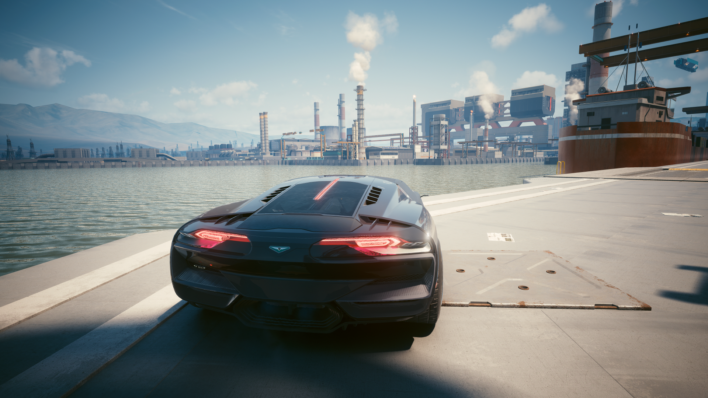
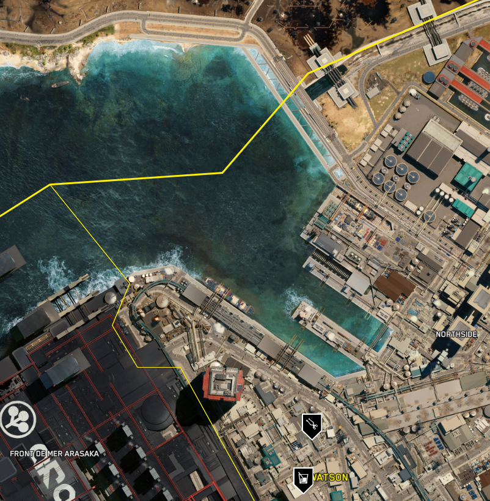

# Night City - Ripperdoc

## Context

### Objective:

```
Your preferred Edgerrunner has sent you this message:

Hi Choum, I saw your mission request. I have an appointment with my ripperdoc to collect the reward of my mission.
My ripperdoc is less than a kilometer from my position.
Meet me at the nearest bar!
```

### Image `Reward.png`:



# Solve

Using this website: [https://maps.piggyback.com/cyberpunk-2077/maps/night-city](https://maps.piggyback.com/cyberpunk-2077/maps/night-city), we can recognize the location of `Reward.png`:



- **Ripperdoc Name**: `Cassius Ryder`
- **Bar Name**: `Totentanz`

## Flag

```
MCTF{Cassius_ryder:Totentanz}
```