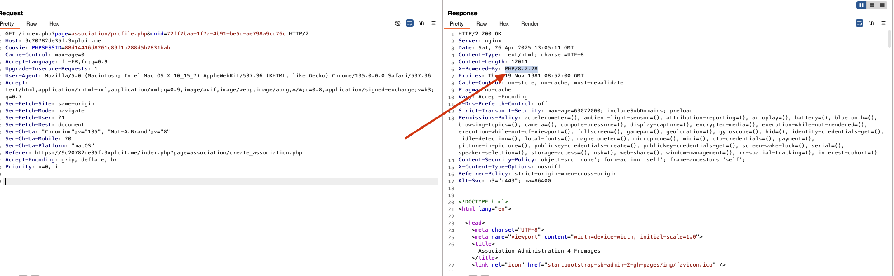

# Header Disclosure

 

# Description

The `Server` header reveals the services used and their versions:

- PHP/8.2.28

# Exploitation&POC

Simply navigating the web application using a proxy like Burp allows retrieving information from the headers returned by the server. The `Server` header reveals these details.

# Risk

An attacker obtaining this information can tailor their future attacks by considering the version of PHP version in use.

# Remediation

Update PHP Server services and configure the server to not display the services and their versions in the `Server` header.

# References

[https://securityboulevard.com/2023/06/application-security-101-http-headers-information-disclosure/](https://securityboulevard.com/2023/06/application-security-101-http-headers-information-disclosure/)

# Author

4Fromages