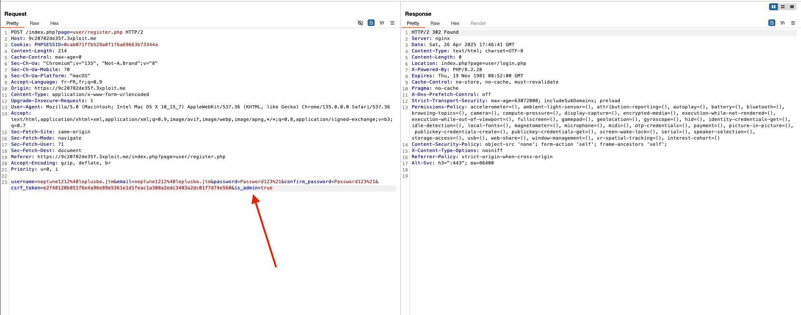
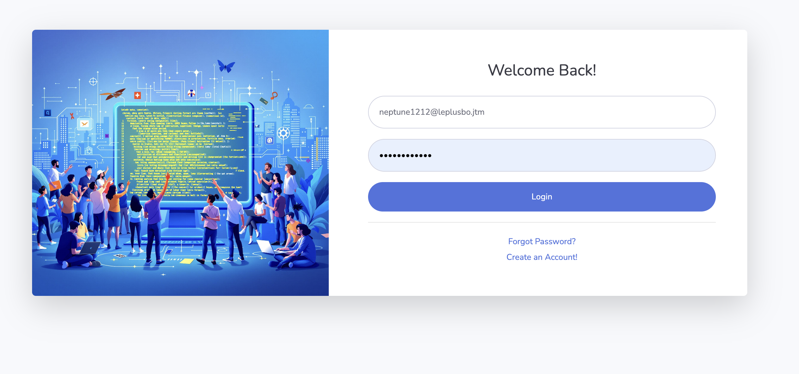
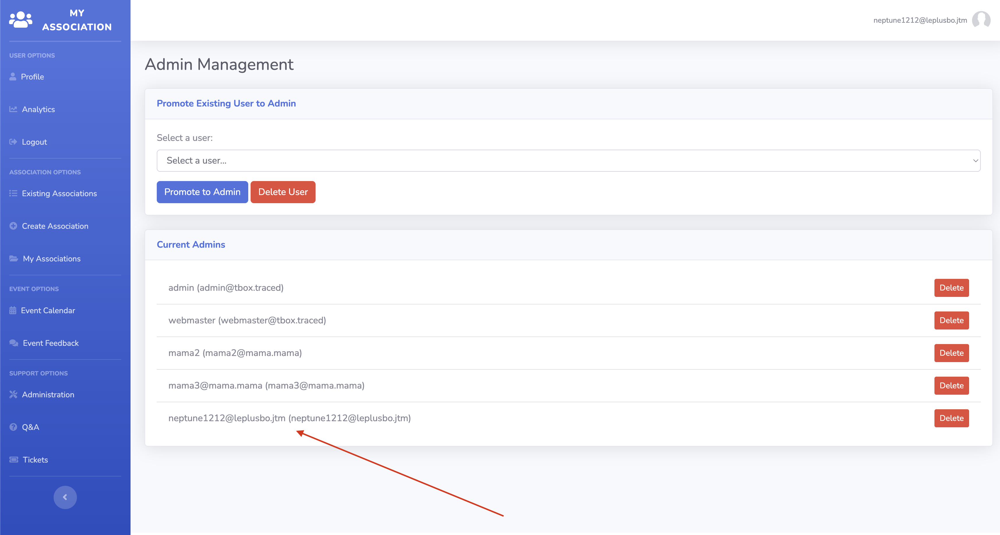

# Improper Privilege Management

 

# Description

A vulnerability was identified allowing an unauthorized user to escalate their privileges by changing their `is_admin` role value. By manipulating client-side requests, an attacker can promote themselves to administrator without proper authorization, compromising the security of the application.

# Exploitation

By intercepting and modifying a request (e.g., during a profile update)with burp for example, a standard user can inject  the `is_admin` parameter, setting it to `true`. Due to the lack of proper server-side validation, the system processes this change and upgrades the user's role to admin, leading to privilege escalation.

# PoC

Make a POST request at  ``/index.php?page=user/register.php`` and add the is_admin=true in the body and. 

Send the request, you are redirected to the login page, login with the credential you put in the previous request 

And there you go ! you are admin, you can acces admin panel etc .. 

# Risk

- **Privilege Escalation**: Attackers can gain unauthorized access to admin-only features.
- **Full Application Compromise**: Could lead to full control over the application and its data.
- **Data Breach**: Unauthorized access to sensitive user data and system configurations.

# Remediation

- Implement strict server-side validation to ensure that only authorized admin users can modify sensitive fields like `is_admin`.
- Remove `is_admin` from any user-editable fields in API endpoints accessible by regular users.
- Enforce a robust Role-Based Access Control (RBAC) mechanism for sensitive operations.

# References

 [https://owasp.org/www-community/Broken_Access_Control](https://owasp.org/www-community/Broken_Access_Control) 

 [https://cwe.mitre.org/data/definitions/269.html](https://cwe.mitre.org/data/definitions/269.html)

# Author

4Fromages