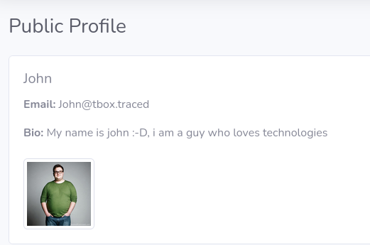

# Information Disclosure

# Description

An **Information Disclosure (CWE-200)** vulnerability has been discovered in the web application, where several internal email addresses are publicly accessible without requiring authentication. Sensitive information, such as email addresses and UUIDs in plain text, can be misused by attackers to target users or gather personal data.

# Exploitation

An attacker can exploit this vulnerability to:

- **Retrieve internal email addresses**: This allows the attacker to obtain valid email addresses of employees or users.
- **Launch targeted phishing campaigns (spear phishing)**: With valid email addresses, the attacker can send fraudulent emails to deceive users into revealing sensitive information or installing malware.
- **Attempt password reset attacks**: Having valid emails, the attacker can try to reset the passwords of associated accounts by exploiting the password reset mechanisms.
- **Gather personal information for broader attacks (reconnaissance)**: Access to this data can also be used for more sophisticated attacks, such as social engineering or privilege escalation attempts.

# PoC

[https://94fb5cc4ec9f.3xploit.me/index.php?page=user/public_profile.php&uuid=8f9f1e30-91d7-4da1-91fc-f685889ef1c7](https://94fb5cc4ec9f.3xploit.me/index.php?page=user/public_profile.php&uuid=8f9f1e30-91d7-4da1-91fc-f685889ef1c7)

[https://94fb5cc4ec9f.3xploit.me/index.php?page=user/public_profile.php&uuid=24f8c0ad-ad4a-4968-a970-0891fe44440f](https://94fb5cc4ec9f.3xploit.me/index.php?page=user/public_profile.php&uuid=24f8c0ad-ad4a-4968-a970-0891fe44440f)

# Risk

The disclosure of sensitive information, such as internal email addresses and UUIDs in plain text, presents several risks, including:

- **Breach of confidentiality**: Internal email addresses can be used to target users and organizations.
- **Escalation of attack**: This information can serve as a starting point for other attacks, such as phishing, password reset attacks, and more complex system exploits.
- **Reputation damage**: The leakage of this information could lead to breaches of employee or customer privacy and harm the organization's reputation.

# Remediation

**Filter access to sensitive information**: Email addresses and UUIDs should be protected with appropriate access controls. Access to this information should only be allowed to authenticated and authorized users.

**Mask or anonymize sensitive information**: If this information is not necessary for the application, consider masking or anonymizing it before displaying it.

# References

OWASP Information Disclosure Cheat Sheet

# Author

4fromages