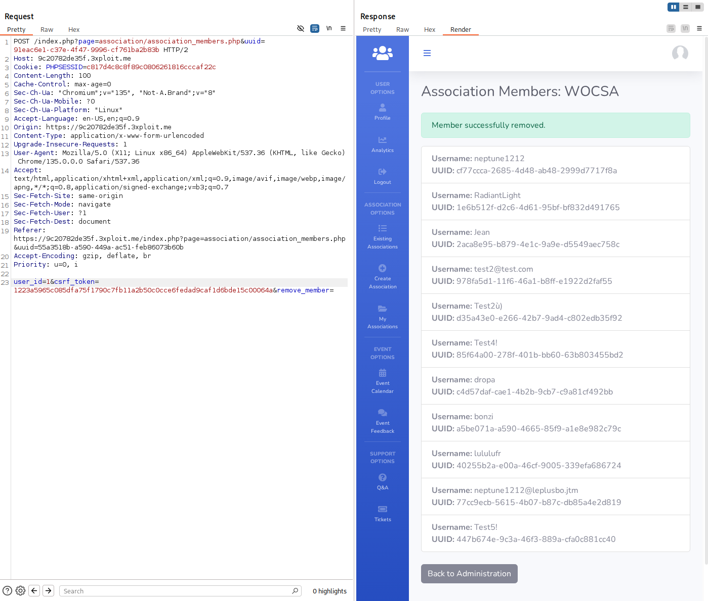

# Insecure Direct Object Reference (IDOR) (CWE-639)

 

# Description

An Insecure Direct Object Reference (IDOR) (CWE-639)  vulnerability occurs when an application exposes a reference to an internal object (such as a file, database record, or directory) in the URL or other request parameter. This allows an attacker to modify the reference and gain unauthorized access to data or functionality that they should not be able to access.

# Exploitation

In the **first example**, the endpoint accepts both a `user_id` and a `uuid` parameter. By **modifying the `user_id` and `uuid` values** manually in the request, an attacker can **force the deletion of other users** from associations without proper authorization.

In the seconde example, using same endpoint using the `uuid` parameter to target desired association and `email` in csv file, an attacker can **force user to join any association** without proper authorization.

In the third example, the URL endpoint `/index.php?page=volunteer/forum.php&id=33&uuid=400760d3-6e4a-430d-ad6e-6c94669e81db` contains the `id` parameter, which can be manipulated to access resources or data that the user is not authorized to view.

By changing the `id` value in the URL from `33` to `1`, an attacker can bypass access controls and view a forum that was intended to be private or restricted. This indicates that the application does not properly validate user input, allowing for unauthorized access to data or functionality.

# PoC

Here is an example of how an attacker can manipulate the `user_id` and `uuid` parameters to delete a user from an association without proper authorization:

Here an example of how an attacker can add user to another association who don’t own, he can manipulate `uuid` of company and `email` from csv import

Here is an example of how an attacker can manipulate the `id` parameter to bypass access controls and view other forums that are restricted to authorized users only:

This modified URL gives the attacker access to the forum page with `id=1`, which they are not authorized to view.

# Risk

- If an attacker manipulates object references, they could gain access to restricted or unauthorized data.
- The attacker might access sensitive information, leading to potential privacy violations or data leakage.
- Without proper access control, attackers could escalate their privileges and gain access to more critical parts of the application.
- The breach of user privacy or critical systems could cause significant reputational harm to the organization.
- Exposing sensitive data can violate regulations like GDPR or HIPAA, leading to potential legal consequences.

# Remediation

To fix the Insecure Direct Object Reference (IDOR) vulnerability, the following actions should be taken:

- **Check access rights to resources systematically**, considering both individual ownership and shared resources.
- **Ensure that access rights to features are properly managed based on user roles**.
- **Avoid direct references in parameters**, especially by limiting user inputs.
- **Always validate user inputs** to prevent manipulation.

# References

[CHEATSHEET IDOR](https://cheatsheet.haax.fr/web-pentest/resources-discovery/idor/) 

[REMEDIATION IDOR](https://cyberwatch.fr/cve/idor/)

# Author

4Fromages