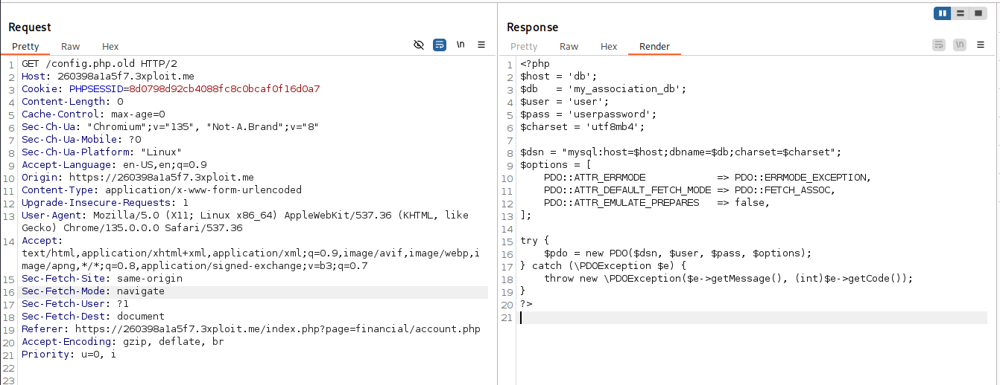

# Password in Configuration File (CWE-260)

 

# **Description**

The application has exposed an old password within a publicly accessible configuration file (`config.php.old`). The file contains sensitive information, including a database connection string with plaintext credentials. These credentials can be accessed by unauthorized actors if the file is not adequately secured or if it is improperly stored in a publicly accessible directory.

# **Exploitation**

If an attacker gains access to the `config.php.old` file, they can extract the sensitive database credentials (username, password). With these credentials, an attacker can potentially:

- Gain unauthorized access to the database and exfiltrate, modify, or delete sensitive data.
- Perform SQL injection attacks with elevated privileges.
- Compromise the integrity and availability of the application and its data.

By simply accessing the URL `GET /config.php.old`, attackers can retrieve the file and obtain the sensitive information stored in it. The old password could allow attackers to bypass authentication mechanisms.

# **PoC**

Request:



```php
<?php
$host = 'db';
$db   = 'my_association_db';
$user = 'user';
$pass = 'userpassword';
$charset = 'utf8mb4';

$dsn = "mysql:host=$host;dbname=$db;charset=$charset";
$options = [
    PDO::ATTR_ERRMODE            => PDO::ERRMODE_EXCEPTION,
    PDO::ATTR_DEFAULT_FETCH_MODE => PDO::FETCH_ASSOC,
    PDO::ATTR_EMULATE_PREPARES   => false,
];

try {
    $pdo = new PDO($dsn, $user, $pass, $options);
} catch (\PDOException $e) {
    throw new \PDOException($e->getMessage(), (int)$e->getCode());
}
?>

```

The above PHP script shows the type of sensitive information (database credentials) that could be exposed in the vulnerable `config.php.old` file. With the exposed username (`user`) and password (`userpassword`), attackers can connect to the database and potentially exploit the system.

# **Risk**

The primary risks associated with this vulnerability include:

- **Data Breach**: Exposure of sensitive user data or application data stored in the database.
- **Unauthorized Access**: Attacker gaining control of the database and manipulating the data.
- **Privilege Escalation**: Using exposed credentials to escalate privileges or pivot within the network.
- **Reputation Damage**: Breach of customer or user trust due to unauthorized access to sensitive data.

# **Remediation**

To remediate this vulnerability, the following actions should be taken:

1. **Remove the `config.php.old` file from the web-accessible directory**: Ensure sensitive files are not exposed to the public.
2. **Restrict file access**: Use `.htaccess` or other configuration settings to restrict access to sensitive files.
3. **Implement file permissions**: Apply appropriate file permissions to ensure that only authorized users or processes can access sensitive configuration files.
4. **Use environment variables**: Store sensitive information like database credentials in environment variables or a secure vault.
5. **Regularly rotate credentials**: Ensure credentials are rotated regularly and are not hardcoded in files.

# **References**

- https://cwe.mitre.org/data/definitions/260.html

# **Author**

4fromages