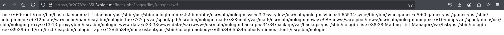

# PATH TRAVERSAL

# Description

A **Local File Inclusion (CWE-79)** vulnerability allows an attacker to include files from the server's filesystem into the web application's response.

This can lead to sensitive file disclosure, code execution (if code files are included), or further attacks such as Remote Code Execution (RCE).

# Exploitation

By manipulating the “page” parameter, it’s possible to include arbitrary files from the server.

Sending the following payload

- `https://9c20782de35f.3xploit.me/index.php?page=file:///etc/passwd`
- `https://9c20782de35f.3xploit.me/index.php?page=php://filter/convert.base64-encode/resource=config.php`

results in the contents of /etc/passwd being displayed in the response.

**No authentication is required to exploit this vulnerability.**

# PoC

# Risk

- **Sensitive information disclosure**: Access to `/etc/passwd`  or configuration file like `config.php` can reveal critical information.
- **Further exploitation**: In some cases, the attacker might include log files or application files to escalate the attack to RCE (Remote Code Execution).
- **Server compromise**: If exploitable further, it could lead to full server takeover.

# Remediation

- **Whitelist** only allowed files/pages on the server side.
- **Avoid directly including user-controlled parameters** without validation and sanitization.
- **Disable wrappers like `file://`** or `php://` if not needed.
- **Apply strict input validation** and use secure functions when including files.

# References

https://portswigger.net/web-security/file-path-traversal

[Portswigger - File Path Traversal](https://portswigger.net/web-security/file-path-traversal)  

# Author

4Fromages