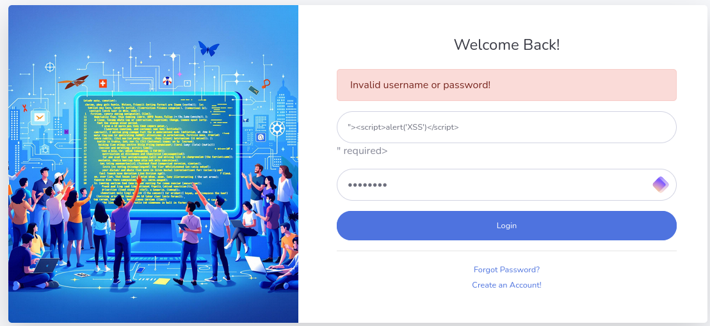

# XSS - Reflected

 

# Description

A Cross-Site Scripting (CWE-79) vulnerability allows an attacker to inject malicious HTML and/or JavaScript code into web pages viewed by users.

Reflected XSS occurs when malicious input (such as a JavaScript payload) is sent by the attacker and immediately reflected by the server into the web page without propre sanitization. The input is not stored on the server but executed in the context of the victim’s browser.

# Exploitation

The “username” parameter is vulnerable to XSS Injection. if `">` is injected into the login form, the code will be executed on the following endpoints:

- [https://9c20782de35f.3xploit.me/index.php?page=user/login.php](https://9c20782de35f.3xploit.me/index.php?page=user/login.php)

# PoC

Here is what it looks like in the HTTP request:

The result of the XSS injection:

# Risk

The main risk lies in session cookie theft and the injection of JavaScript code that prompts the user to enter their password in a malicious form.

# Remediation

- Always sanitize the HTML code generated by the application before sending it to the browser
- Filter displayed or saved variables containing '<' and '>' characters (in CGI or PHP). More generally, prefix variables containing strings from external sources (e.g., using the prefix "us" for user strings) to distinguish them from others, and never use any of these values in an executable string (especially an SQL string, which can also be targeted by SQL injection) without prior filtering.
- In PHP
    - Use the htmlspecialchars() function, which filters ‘<’ and ‘>’
    - Use the htmlentities() function, which is to htmlspecialchars() but filters all characters equivalent to HTML or JavaScript Encoding

# References

https://owasp.org/www-community/attacks/xss/

[CloudWays](https://www.cloudways.com/blog/prevent-xss-in-php/)

# Author

4Fromages