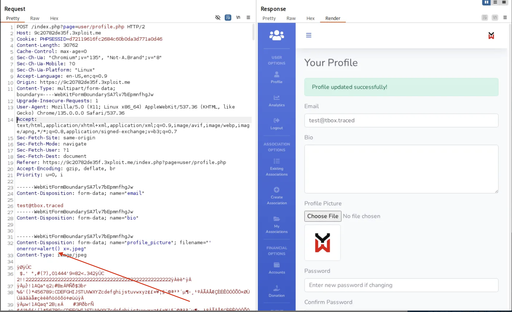

# XSS - Stored

 

# Description

A **Stored Cross-Site Scripting (Stored XSS)** vulnerability was discovered in the profile functionality of the website.

By uploading a specially crafted filename for the profile picture, an attacker can inject arbitrary JavaScript into the victim's browser.

Since the uploaded profile picture is displayed without proper sanitization in a `` tag's `src` attribute, malicious payloads are executed when other users visit the affected profile page.

This vulnerability allows an attacker to execute arbitrary JavaScript in the context of other users, potentially leading to account compromise, session hijacking, phishing, or full site takeover depending on the victim's privileges.

---

# Exploitation

An attacker uploads a malicious file using the profile picture update functionality:

### Vulnerable Request:



After uploading, the rendered HTML on the public profile page becomes:


When a user visits the profile page:

- The `src` attribute loads a broken image (`uploads/'`) → triggers the `onerror=alert()`.
- The malicious JavaScript is executed immediately in the victim's browser.

---

# PoC (Proof of Concept)

1. Log in as a regular user.
2. Navigate to profile editing page (`/index.php?page=user/profile.php`).
3. Upload a file with the filename: 

```jsx
‘onerror=alert() x=.jpeg
```


1. Save the changes.
2. View the public profile.
3. **JavaScript `alert()` will trigger**, proving stored XSS execution.


---

# Risk

- **Impact:** High (Stored XSS allows persistent JavaScript execution across multiple users)
- **Attack Vector:** Remote — attacker needs only to upload a crafted profile picture
- **Affected Users:** Any visitor viewing the malicious user’s profile
- **Potential Impact:** Account hijacking, session theft, phishing attacks, site-wide compromise (if admin views)

---

# Remediation

✅ To prevent this vulnerability:

- **Sanitize all untrusted input** before placing it into HTML attributes.
    - Use built-in functions like `htmlspecialchars($string, ENT_QUOTES, 'UTF-8')` in PHP.
- **Validate and sanitize file names** on upload.
    - Reject or sanitize special characters like quotes (`"`, `'`), `<`, `>`, etc.
- **Force rename uploaded files** to server-generated safe names (e.g., using random UUIDs) instead of trusting user-provided filenames.
- **Implement Content Security Policy (CSP)** headers to mitigate XSS even if input escapes fail.

Example secure PHP usage:

```php
" ... >
```

---

# References

- https://owasp.org/www-community/attacks/xss/
- https://cwe.mitre.org/data/definitions/79.html

---

# Author

4Fromages